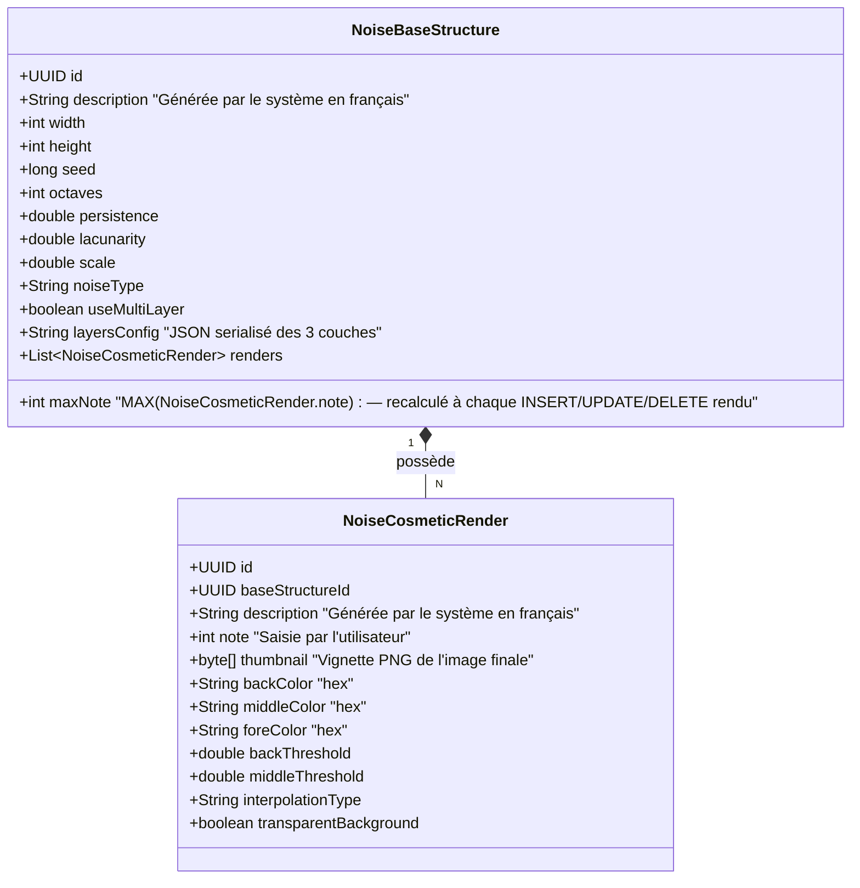
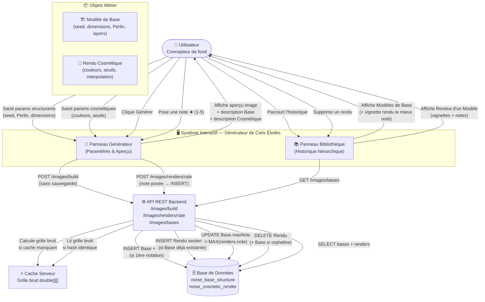
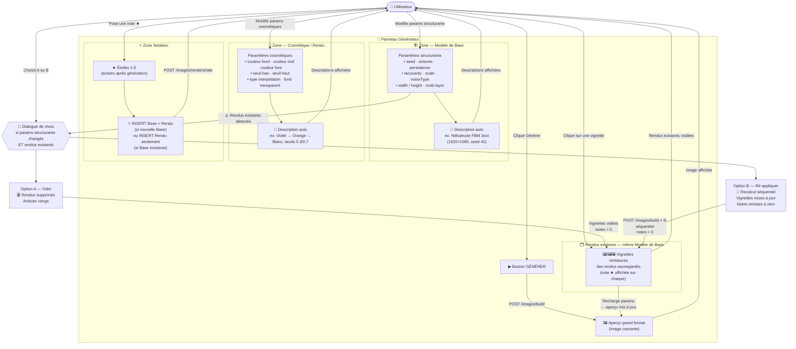

# Amélioration du Flux de Travail : Ciel Étoilé (sbgb-cmd)

## 1. Objectif

Isoler les paramètres structurants (qui définissent la forme du bruit) des paramètres cosmétiques (qui définissent
l'apparence visuelle). Cela permet de mettre en cache la structure de base calculée et de recalculer rapidement
l'habillage colorimétrique sans regénérer tout le bruit Perlin.

---

## 2. Analyse de l'existant (sbgb-cmd)

La génération d'une image repose sur deux objets imbriqués dans `ImageRequestCmd` :

- **`SizeCmd`** : paramètres de structure (seed, dimensions, bruit Perlin)
- **`ColorCmd`** : paramètres de couleur (3 couleurs hex + seuils + interpolation)

L'entité persisée `NoiseImage` contient deux objets `@Embeddable` :

- **`ImageStructure`** : seed, width, height, octaves, persistence, lacunarity, scale, preset, useMultiLayer, noiseType
- **`ImageColor`** : back, middle, fore (hex), backThreshold, middleThreshold, interpolationType, transparentBackground

### 2.1. Paramètres Structurants (Modèle de Base)

Ces paramètres définissent la **forme du champ de bruit**. Les modifier implique de recalculer entièrement la grille de
bruit Perlin.

- **`seed`** : détermine la séquence pseudo-aléatoire → forme unique du bruit
- **`width` / `height`** : dimensions de la grille de génération
- **`octaves`** : nombre de couches de bruit fractal → niveau de détail
- **`persistence`** : amplitude des octaves successives → contraste global
- **`lacunarity`** : fréquence des octaves successives → densité des détails
- **`scale`** : échelle du bruit → zoom sur la structure
- **`noiseType`** : type d'algorithme (Perlin, FBM, Ridged…) → nature de la texture
- **`useMultiLayer`** / `layers` : activation et config des 3 couches (Fond / Nébuleuse / Étoiles)

### 2.2. Paramètres Cosmétiques / Rendu

Ces paramètres dictent **comment le bruit est habillé visuellement**. La grille `N(x,y)` est déjà calculée — ils
s'appliquent uniquement lors de l'étape de rendu (colorisation + canal alpha).

- **`back`** : couleur de fond (hex)
- **`middle`** : couleur intermédiaire (hex)
- **`fore`** : couleur de premier plan / haute intensité (hex)
- **`backThreshold`** : seuil bas de la rampe de couleur (0.0–1.0)
- **`middleThreshold`** : seuil haut de la rampe de couleur (0.0–1.0)
- **`interpolationType`** : mode d'interpolation entre les couleurs (LINEAR, SMOOTH…)
- **`transparentBackground`** : active le canal alpha (pixels < `backThreshold` → alpha = 0) — décision de rendu,
  `N(x,y)` inchangée

---

## 3. Proposition de Refactoring

### 3.1. Séparation des Value Objects

Diviser la structure actuelle en deux concepts logiques :

- **`NoiseBaseStructure`** (structurant) : `seed`, `width`, `height`, `octaves`, `persistence`, `lacunarity`, `scale`,
  `noiseType`, `useMultiLayer`, `layers`
- **`NoiseCosmeticRender`** (cosmétique) : `back`, `middle`, `fore`, `backThreshold`, `middleThreshold`,
  `interpolationType`, `transparentBackground`

### 3.2. Mise en Cache

- Mettre en cache la grille de bruit normalisée (tableau `double[][]`) calculée pour un `NoiseBaseStructure` donné.
- La clé de cache est le **hash des paramètres structurants** (`seed` + dimensions + paramètres Perlin + config layers).
- Un changement cosmétique seul → pas de recalcul du bruit, simple ré-application de la colorisation.

---

## 4. Cahier des Charges du Nouveau Flux de Travail

### 4.1. Refonte de l'IHM (Séparation Claire)

L'IHM `sbgb-param.component` sera restructurée en deux zones bien distinctes :

- **Zone "Modèle de Base"** : seed, dimensions, paramètres Perlin (octaves, persistence, lacunarity, scale, noiseType),
  multi-layer + description auto-générée.
- **Zone "Cosmétique / Rendu"** : 3 couleurs, 2 seuils, interpolation, fond transparent + description auto-générée.

### 4.2. Double Description Auto-générée

- **Description Modèle de Base** : ex. `"Nébuleuse FBM 3 octaves (1920×1080, seed 42)"`
- **Description Cosmétique** : ex. `"Violet → Orange → Blanc, seuils 0.3 / 0.7"`

### 4.3. Historique et Regroupement (1 Base pour N Rendus)

- La base de données mémorise la relation : **1 `NoiseBaseStructure`** possède **N `NoiseCosmeticRender`**.
- La bibliothèque liste les **Modèles de Base** (vignette du rendu le mieux noté).
- En cliquant sur un Modèle de Base, on voit la liste de ses rendus cosmétiques avec leurs notes.

### 4.4. Règle Métier de Sauvegarde

- **Déclencheur unique** : une image n'existe en base de données que si l'utilisateur lui a **attribué une note**.
- Sans notation, l'image est temporaire (en cache serveur / mémoire frontend). Aucun `INSERT` avant la note.
- **1ère notation** → `INSERT NoiseBaseStructure` + `INSERT NoiseCosmeticRender` (avec note).
- **Notation suivante** (même Base, paramètres cosmétiques différents) → `INSERT NoiseCosmeticRender` seulement,
  rattaché à la Base existante.
- La note du **Modèle de Base** est calculée automatiquement : `MAX(NoiseCosmeticRender.note)`.

### 4.5. Génération à la Demande

L'utilisateur peut recharger un rendu depuis la bibliothèque :

1. Les paramètres structurants sont rechargés → la grille de bruit est recalculée (ou servie depuis le cache si
   disponible).
2. Les paramètres cosmétiques sont rechargés → la colorisation est appliquée.
3. L'image est affichée sans sauvegarde automatique.

### 4.6. Modification des Paramètres Structurants avec Rendus Existants

Si l'utilisateur modifie un paramètre structurant alors que des rendus sauvegardés existent pour ce Modèle de Base, le
système affiche une **boîte de dialogue de choix** :

- **Option A — Vider les rendus** : Les rendus cosmétiques existants sont supprimés. Le Modèle de Base devient un
  nouveau point de départ. L'utilisateur repart d'une ardoise vierge.
- **Option B — Ré-appliquer les cosmétiques** : Chaque rendu cosmétique est recalculé en série sur le nouveau Modèle de
  Base (traitement séquentiel). Les vignettes sont mises à jour.

Dans les deux cas, **toutes les notes sont remises à zéro** : les images issues du recalcul sont temporaires. La moindre
notation déclenchera un **nouvel `INSERT`** (jamais d'`UPDATE`).

---

## 5. Structure de la Base de Données

La table plate actuelle `noise_image` est remplacée (RAZ, pas de migration) par deux nouvelles tables :



---

## 6. Architecture des Couches

### 6.1. Domain Layer (sbgb-application)

- **Entités de Domaine** : Remplacer `NoiseImage` par `NoiseBaseStructure` (1) et `NoiseCosmeticRender` (N).
- **Use Cases** :
  - `BuildNoiseImageUseCase` : génère l'image en mémoire à partir d'une Base + un Cosmétique (sans `INSERT`).
  - `RateNoiseCosmeticRenderUseCase` : 1er déclencheur de sauvegarde — insère la Base (si nouvelle) + le Rendu avec sa
    note.
  - `FindNoiseBaseStructuresUseCase` : liste les Modèles de Base (avec vignette du meilleur rendu).
  - `FindNoiseCosmeticRendersUseCase` : liste les rendus d'une Base donnée.
  - `DeleteNoiseCosmeticRenderUseCase` : supprime un rendu (et la Base si orpheline). Met à jour `maxNote` de la Base.
  - `ReapplyCosmeticsUseCase` : recalcule tous les rendus d'une Base sur une nouvelle structure (Option B du dialogue).

### 6.2. Infrastructure Layer (sbgb-infrastructure)

- **Liquibase** : Créer les tables `noise_base_structure` et `noise_cosmetic_render` (sans migration des données).
- **Adapters JPA** : `NoiseBaseStructurePersistenceAdapter`, `NoiseCosmeticRenderPersistenceAdapter`.

### 6.3. Exposition Layer (sbgb-exposition)

| Méthode  | Endpoint                     | Description                                                     |
|----------|------------------------------|-----------------------------------------------------------------|
| `POST`   | `/images/build`              | Génère une image (Base + Cosmétique) — aucun INSERT             |
| `POST`   | `/images/renders/rate`       | Note un rendu → déclenche l'INSERT (Base + Rendu ou Rendu seul) |
| `GET`    | `/images/bases`              | Liste les Modèles de Base (+ vignette du rendu le mieux noté)   |
| `GET`    | `/images/bases/{id}/renders` | Liste les Rendus d'une Base                                     |
| `DELETE` | `/images/renders/{id}`       | Supprime un Rendu (+ Base si orpheline)                         |

### 6.4. Frontend Layer (sbgb-gui)

- **Stratégie** : Créer de nouveaux composants dédiés. Ne pas modifier les composants partagés avec la Galaxie.
- **Modèles** (`sbgb.model.ts`) : Ajouter `NoiseBaseStructureDto` et `NoiseCosmeticRenderDto`. Supprimer
  `NoiseImageDto`.
- **Composant Générateur** (`sbgb-param.component`) :
  - **Zone "Modèle de Base"** : seed, dimensions, paramètres Perlin, multi-layer, fond transparent, description auto.
  - **Zone "Cosmétique"** : 3 couleurs, 2 seuils, interpolation, description auto.
  - **Zone "Rendus existants"** : Vignettes des rendus sauvegardés pour la Base courante (clic → recharge les params).
  - **Zone "Notation"** : Étoiles 1–5 — uniquement actives après une génération. Seul déclencheur de sauvegarde.
- **Composant Bibliothèque** (nouveau `sbgb-history-list.component`) :
  - Liste hiérarchique : Modèles de Base → au clic → liste de leurs Rendus avec notes.

---

## 7. Schéma de Contexte d'Interaction (GRAAL)



### Lecture GRAAL

| Élément GRAAL          | Dans notre contexte                                                          |
|------------------------|------------------------------------------------------------------------------|
| **Acteur principal**   | L'Utilisateur (concepteur de fond d'écran)                                   |
| **Système Interactif** | Application Angular — 2 panneaux : Générateur + Bibliothèque                 |
| **Flux entrants**      | Saisie params structurants & cosmétiques, clic Générer, notation ★           |
| **Flux sortants**      | Aperçu image, descriptions générées, liste hiérarchique Base→Rendus          |
| **Entités externes**   | API REST (Spring Boot), PostgreSQL, Cache grille bruit                       |
| **Règle métier clé**   | La sauvegarde n'est déclenchée que par la **pose d'une note** — jamais avant |
| **Relation 1..N**      | 1 Modèle de Base possède N Rendus Cosmétiques                                |
| **Note calculée**      | note(Base) = MAX des notes de ses Rendus — jamais saisie directement         |

---

## 7.1. Zoom — Panneau Générateur (5 zones + dialogue de choix)



| Zone                     | Contenu                                                                               | Interaction clé                                                |
|--------------------------|---------------------------------------------------------------------------------------|----------------------------------------------------------------|
| 🏗️ **Modèle de Base**   | seed, dimensions, paramètres Perlin, multi-layer, fond transparent + description auto | Saisie → détection rendus existants → dialogue si nécessaire   |
| 🎨 **Cosmétique**        | 3 couleurs hex, 2 seuils, interpolation + description auto                            | Saisie → re-rendu uniquement, aucun dialogue                   |
| 🗂️ **Rendus existants** | Vignettes des rendus sauvegardés pour ce Modèle de Base                               | Clic → recharge params · après recalcul : notes = 0            |
| ⭐ **Notation**           | Étoiles 1–5 (actives après génération)                                                | **Unique déclencheur de sauvegarde** — INSERT systématique     |
| 💬 **Dialogue de choix** | Affiché quand params structurants changent ET rendus existants                        | **A** : vider · **B** : recalcul séquentiel + toutes notes = 0 |

---

## 8. Maquette IHM Cible

### 8.1. Panneau Générateur — Zone paramètres déployée (accordéon ouvert)

```
┌─────────────────────────────────────────────────────────────────────────┐
│  🌌  Générateur de Ciel Étoilé                                          │
├─────────────────────────────────────────────────────────────────────────┤
│  ▼  Paramètres                                                          │
├────────────────────────────────────┬────────────────────────────────────┤
│  🏗️  MODÈLE DE BASE               │  🎨  COSMÉTIQUE / RENDU            │
│                                    │                                    │
│  Seed          [        42       ] │  Couleur fond   [███ #0a0a1e     ] │
│  Largeur       [      1920       ] │  Couleur mid    [███ #6b2d8b     ] │
│  Hauteur       [      1080       ] │  Couleur fore   [███ #ff9500     ] │
│  ────────────────────────────────  │  ────────────────────────────────  │
│  Algorithme    [  FBM          ▼] │  Seuil bas      [──●────────] 0.30 │
│  Octaves       [         3      ] │  Seuil haut     [────────●──] 0.70 │
│  Persistence   [       0.5      ] │  Interpolation  [  SMOOTH       ▼] │
│  Lacunarity    [       2.0      ] │  ────────────────────────────────  │
│  Échelle       [       100      ] │  Fond transparent  ○ Non  ● Oui    │
│  ────────────────────────────────  │                                    │
│  Multi-layer   [x] Activé        │  📝 "Violet → Orange → Blanc,      │
│  [ Fond ] [ Nébuleuse ] [ Étoiles]│       seuils 0.30/0.70, opaque"    │
│  ────────────────────────────────  │                                    │
│  📝 "FBM 3oct (1920×1080,        │                                    │
│       seed 42)"                   │                                    │
├────────────────────────────────────┴────────────────────────────────────┤
│                          [  ▶  GÉNÉRER  ]                               │
├───────────────────────────────────────────────┬─────────────────────────┤
│                                               │  ⭐ Notation            │
│                                               │                         │
│              🖼️  APERÇU                       │   ★ ★ ★ ☆ ☆            │
│         (image générée courante)              │                         │
│                                               │  Poser une étoile       │
│                                               │  sauvegarde cette image │
│                                               │  dans les rendus        │
│                                               │  ci-dessous.            │
│                                               │                         │
├───────────────────────────────────────────────┴─────────────────────────┤
│  🗂️  Rendus sauvegardés — Modèle de Base courant                       │
│                                                                         │
│  ┌───────────┐   ┌───────────┐   ┌───────────┐                         │
│  │  🖼️       │   │  🖼️       │   │  🖼️       │                         │
│  │           │   │           │   │           │                         │
│  │  ★★★★☆   │   │  ★★★☆☆   │   │  ★★★★★   │                         │
│  └───────────┘   └───────────┘   └───────────┘                         │
│   violet/org      bleu/cyan       rouge/or                             │
└─────────────────────────────────────────────────────────────────────────┘
```

---

### 8.1b. Panneau Générateur — Zone paramètres repliée (accordéon fermé)

```
┌─────────────────────────────────────────────────────────────────────────┐
│  🌌  Générateur de Ciel Étoilé                                          │
├─────────────────────────────────────────────────────────────────────────┤
│  ▶  Paramètres  │ 🏗️ "FBM 3oct (1920×1080, seed 42)"                   │
│                 │ 🎨 "Violet → Orange → Blanc, seuils 0.30/0.70"        │
├─────────────────────────────────────────────────────────────────────────┤
│                          [  ▶  GÉNÉRER  ]                               │
├───────────────────────────────────────────────┬─────────────────────────┤
│                                               │  ⭐ Notation            │
│                                               │                         │
│              🖼️  APERÇU                       │   ★ ★ ★ ☆ ☆            │
│         (image générée courante)              │                         │
│                                               │  Poser une étoile       │
│                                               │  sauvegarde cette image │
│                                               │  dans les rendus        │
│                                               │  ci-dessous.            │
│                                               │                         │
├───────────────────────────────────────────────┴─────────────────────────┤
│  🗂️  Rendus sauvegardés — Modèle de Base courant                       │
│                                                                         │
│  ┌───────────┐   ┌───────────┐   ┌───────────┐                         │
│  │  🖼️       │   │  🖼️       │   │  🖼️       │                         │
│  │           │   │           │   │           │                         │
│  │  ★★★★☆   │   │  ★★★☆☆   │   │  ★★★★★   │                         │
│  └───────────┘   └───────────┘   └───────────┘                         │
│   violet/org      bleu/cyan       rouge/or                             │
└─────────────────────────────────────────────────────────────────────────┘
```

**Notes de lecture :**

- `▼` / `▶` sur "Paramètres" = accordéon pour afficher/masquer les deux colonnes de saisie.
- Accordéon replié : les deux descriptions auto-générées restent visibles en résumé, permettant de savoir ce qui est
  configuré sans rouvrir.
- Le bouton GÉNÉRER est toujours visible, accordéon ouvert ou fermé.
- La notation (étoiles) est positionnée à droite de l'aperçu — elle porte sur l'image affichée.
- Poser une étoile = `POST /images/renders/rate` → l'image courante apparaît comme nouvelle vignette dans les rendus
  sauvegardés.
- Cliquer sur une vignette existante recharge ses paramètres (Base + Cosmétique) dans les zones de saisie et affiche
  l'image.

---

### 8.2. Dialogue de Choix (Modification Structurante avec Rendus Existants)

```
  ┌────────────────────────────────────────────────────────┐
  │  ⚠️  Modification structurante détectée                │
  │                                                        │
  │  3 rendus sauvegardés existent pour ce Modèle de Base. │
  │  Que souhaitez-vous faire ?                            │
  │                                                        │
  │  ┌──────────────────────────────────────────────────┐  │
  │  │  A — Vider les rendus                            │  │
  │  │  Les 3 rendus sont supprimés définitivement.     │  │
  │  │  Le Modèle de Base repart à zéro.                │  │
  │  └──────────────────────────────────────────────────┘  │
  │                                                        │
  │  ┌──────────────────────────────────────────────────┐  │
  │  │  B — Ré-appliquer les cosmétiques                │  │
  │  │  Les 3 rendus sont recalculés sur la nouvelle    │  │
  │  │  structure (séquentiel). Les vignettes sont      │  │
  │  │  mises à jour. Toutes les notes sont remises     │  │
  │  │  à zéro.                                         │  │
  │  └──────────────────────────────────────────────────┘  │
  │                                                        │
  │                  [ Annuler ]                           │
  └────────────────────────────────────────────────────────┘
```

---

### 8.3. Panneau Bibliothèque (`sbgb-history-list`)

```
┌─────────────────────────────────────────────────────────────────────────┐
│  📚  Bibliothèque — Ciels Étoilés                                       │
├─────────────────────────────────────────────────────────────────────────┤
│                                                                         │
│  ┌──────────────────────────────────────────────────────────────────┐   │
│  │  🏗️  FBM 3oct (1920×1080, seed 42)               ★★★★★ (max)   │▼  │
│  │                                                                  │   │
│  │  ┌─────────┐  ┌─────────┐  ┌─────────┐                         │   │
│  │  │  🖼️    │  │  🖼️    │  │  🖼️    │                         │   │
│  │  │ ★★★★☆ │  │ ★★★☆☆ │  │ ★★★★★ │                         │   │
│  │  │violet  │  │bleu    │  │rouge   │                         │   │
│  │  └─────────┘  └─────────┘  └─────────┘  [ 🗑 Supprimer rendu ] │   │
│  └──────────────────────────────────────────────────────────────────┘   │
│                                                                         │
│  ┌──────────────────────────────────────────────────────────────────┐   │
│  │  🏗️  Perlin 5oct (1280×720, seed 7)               ★★★☆☆ (max)  │▶  │
│  └──────────────────────────────────────────────────────────────────┘   │
│                                                                         │
│  ┌──────────────────────────────────────────────────────────────────┐   │
│  │  🏗️  Ridged 4oct (2560×1440, seed 128)            ★★☆☆☆ (max)  │▶  │
│  └──────────────────────────────────────────────────────────────────┘   │
│                                                                         │
└─────────────────────────────────────────────────────────────────────────┘
```

**Notes de lecture :**

- Chaque ligne est un **Modèle de Base**, affiché avec sa note max (calculée).
- `▼` = déployé (rendus visibles) · `▶` = replié.
- Au clic sur une vignette de rendu → navigation vers le Panneau Générateur, paramètres rechargés.
- La corbeille supprime un rendu individuel (recalcule `maxNote` de la Base).
- Si suppression du dernier rendu → la Base est supprimée automatiquement.

---

## 9. Plan de Vérification

1. **Génération & Cache** : Générer une image → aucun `INSERT` en DB. L'image est affichée.
2. **Première Notation (1ère sauvegarde)** : Noter à 4 → `POST /images/renders/rate`. Vérifier en DB : 1 Base + 1 Rendu
   créés. `Base.maxNote = 4`.
3. **Deuxième Notation (même Base, cosmétique différente)** : Changer une couleur → regénérer → noter à 5 → Vérifier en
   DB : 1 nouveau Rendu ajouté à la **même Base**. `Base.maxNote = 5`.
4. **Suppression** : Supprimer le rendu noté 5 → `Base.maxNote` retombe à 4.
5. **Dialogue Option A** : Modifier `seed` alors que 2 rendus existent → choisir A → Base et rendus supprimés. Ardoise
   vierge.
6. **Dialogue Option B** : Modifier `octaves` alors que 2 rendus existent → choisir B → 2 nouveaux aperçus calculés
   séquentiellement. Notes à 0 sur les vignettes.
