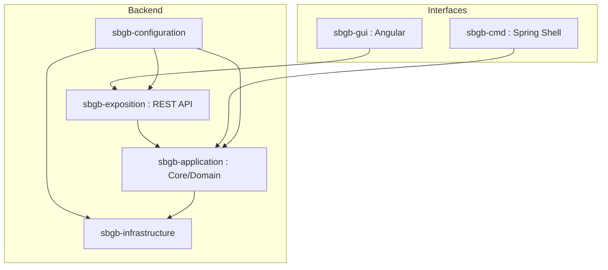

# Document d'Architecture - SpaceBackGroundBuilder (SBGB)

Ce document décrit l'architecture logicielle du projet SpaceBackGroundBuilder (SBGB), un outil de génération d'images d'
arrière-plan spatiales utilisant des algorithmes de bruit (noise).

## 1. Vue d'ensemble

L'objectif de SBGB est de fournir un moteur de génération d'images spatiales (nébuleuses, étoiles, etc.) accessible via
plusieurs interfaces : une API REST, une ligne de commande (CLI) et une interface graphique (GUI).

## 2. Architecture Technique

Le projet suit une architecture modulaire inspirée de l'**Architecture Hexagonale (Ports et Adapteurs)**, permettant de
découper la logique métier des détails techniques d'infrastructure et d'exposition.

### Structure des Modules Maven

- **`sbgb-application`** : Le cœur du système. Contient la logique métier, les modèles de domaine et les services de
  génération d'images. Il dépend de la bibliothèque `jnoise`.
- **`sbgb-exposition`** : Couche d'exposition Web. Contient les contrôleurs REST (Spring WebFlux) permettant de générer
  des images via des requêtes HTTP.
- **`sbgb-configuration`** : Module de configuration central. Il assemble les différents modules et contient la classe
  principale `SbgbApplication`.
- **`sbgb-infrastructure`** : (En cours) Destiné à contenir les implémentations de persistence ou les services externes.
- **`sbgb-cmd`** : Interface en ligne de commande basée sur Spring Shell.
- **`sbgb-gui`** : Application Front-end développée avec Angular.

### Diagramme de Modules (Mermaid)

## 3. Choix Technologiques

### Backend (Java)

- **Java 25** : Version du langage (alignée sur l'environnement de build).
- **Spring Boot 3.2.2** : Framework principal pour l'injection de dépendances et la configuration.
- **Spring WebFlux** : Pour une stack réactive (utilisé dans `sbgb-exposition`).
- **Spring Shell** : Pour l'interface CLI.
- **JNoise** : Pipeline de génération de bruit (Perlin, etc.).
- **SLF4J / Getters & Setters natifs** : Utilisation de code Java standard à la place de Lombok pour assurer la
  compatibilité avec Java 25.

### Frontend

- **Angular** : Framework pour l'interface utilisateur.

### Build & Déploiement

- **Maven** : Gestionnaire de build.
- **Docker / Compose** : Conteneurisation de l'application (fichiers `compose.yaml` présents dans les modules).

## 4. Logique de Génération (Domaine)

La génération d'images repose sur la classe `SpaceBackGroundFactory` dans le module `sbgb-application`.

1. **Pipeline de Bruit** : Utilisation du bruit de Perlin avec une graine (seed) spécifique.
2. **Normalisation** : Les valeurs de bruit sont normalisées entre 0 et 1.
3. **Colorisation (Nébuleuses)** : Application d'un dégradé de couleurs complexe (Noir -> Violet Profond -> Orange ->
   Blanc) basé sur les seuils de bruit.
4. **Champ d'Étoiles** : Génération aléatoire de points lumineux superposés aux nébuleuses avec un mélange additif.
5. **Optimisation** : Rendu direct des pixels via `BufferedImage.setRGB` pour une meilleure performance.

## 5. Endpoints API (Exemple)

| Méthode | Path               | Description                                                                                   |
|---------|--------------------|-----------------------------------------------------------------------------------------------|
| POST    | `/images`          | Génère une image PNG basée sur les paramètres fournis (largeur, hauteur, seed, starsDensity). |
| GET     | `/swagger-ui.html` | Documentation interactive de l'API.                                                           |
